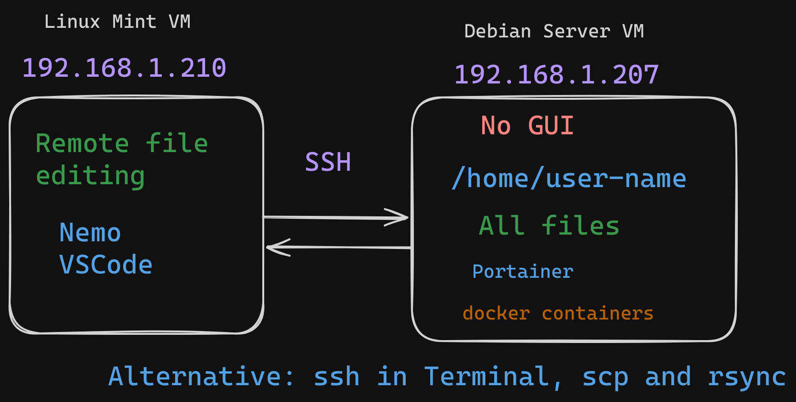
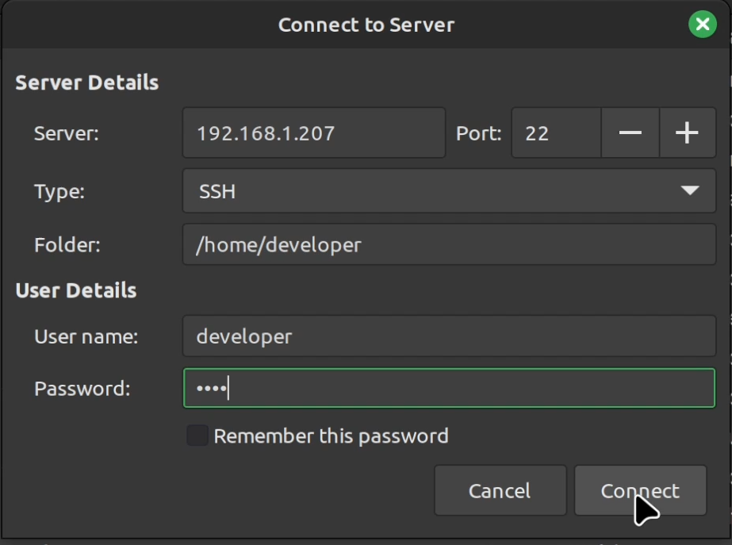
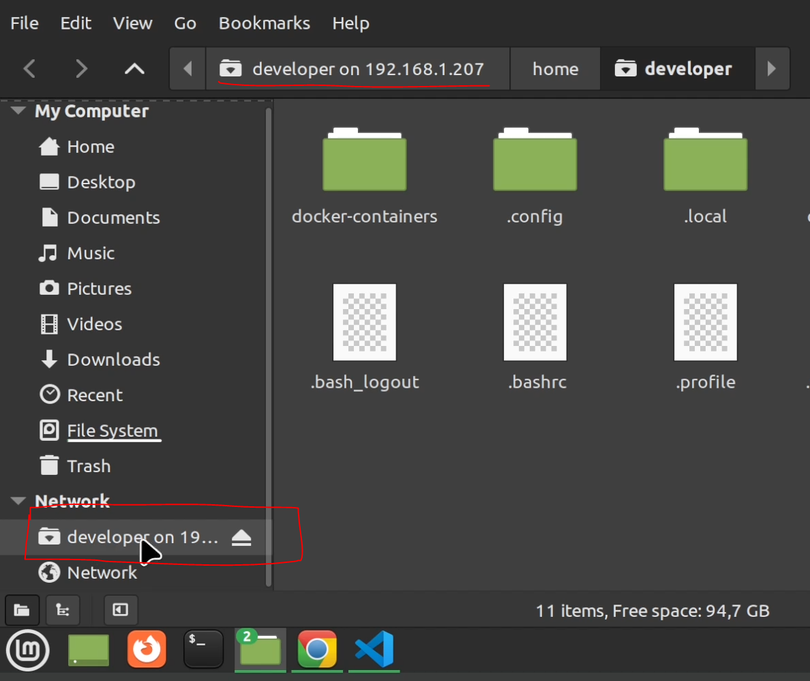

# Docker

Dev Sharing video tutorial: [Debian server how to install docker with bash script the fast variant](https://youtu.be/mLj0_0KCgtc)

install docker on Debian server.
Docker provides a convenience script at https://get.docker.com/ to install Docker into development environments 
non-interactively. 
The convenience script isn't recommended for production environments, but it's useful for creating a 
provisioning script tailored to your needs. 
source: https://docs.docker.com/engine/install/ubuntu/#install-using-the-convenience-script
```sh
# https://github.com/docker/docker-install
curl -fsSL https://get.docker.com -o get-docker.sh
sh get-docker.sh

sudo usermod -aG docker developer
# reboot system !
```

## Installing docker-compose

Dev Sharing video tutorial: [Debian server how to install docker compose and run PostgreSQL and PgAdmin from .yml file](https://youtu.be/iHIXpWrBt_A)

Dockerfile vs Docker compose:
A Dockerfile is a text document with a series of commands used to build a Docker image. 
Docker Compose is a tool for defining and running multi-container applications
```sh
curl -s https://api.github.com/repos/docker/compose/releases/latest | grep browser_download_url  | grep docker-compose-linux-x86_64 | cut -d '"' -f 4 | wget -qi -

chmod +x docker-compose-linux-x86_64
sudo mv docker-compose-linux-x86_64 /usr/local/bin/docker-compose

docker-compose version
```

```sh
./files/docker-containers/postgresql-pg-admin/
mkdir docker-containers
cd docker-containers/
mkdir postgresql-pg-admin
touch docker-compose.yml
nano docker-compose.yml
# "Ctrl + C" , then pres "Y"

#
docker-compose up

# to stop current running conainer from docker-compose command
# use shortcut "Ctrl + C" 

# start dcoker-compose.yml file from current directory in deatach mode(in background)
docker-compose up -d


# stop running containers from wcurrent directory
docker-compose down

docker ps
```

# How to mount remote directory and files for Debian server and from Nemo or VSCode



[Excalidraw file](./files/How-to-mount-remote-directory-and-files-for-debian-server-and-from-Nemo-or-VSCode.excalidraw)

Dev Sharing video tutorial: [How to mount remote directory and files for Debian server and from Nemo or VSCode](https://youtu.be/pn08_TjsR1g)


Nemo File Explorer -> Connect to Server:


Nemo File Explorer -> Network tab wit mounted remote Home directory:



# Portainer

## Install and Configure Portainer

https://docs.portainer.io/

These installation instructions are for Portainer Community Edition (CE).
https://docs.portainer.io/start/install-ce/server/docker/linux


By default, Portainer generates and uses a self-signed SSL certificate to secure port 9443
```sh
# create a persistent volume for your data
docker volume create portainer_data

docker run -d -p 8000:8000 -p 9443:9443 --name portainer --restart=always -v /var/run/docker.sock:/var/run/docker.sock -v portainer_data:/data portainer/portainer-ce:latest
```

variant with  docker-compose.yml file:
```yml
version: '3.3'

volumes:
  portainer-data:
    driver: local
services:
  app:
    container_name: portainer
    image: portainer/portainer-ce:latest
    ports:
      - 8000:8000
      - 9443:9443
    volumes:
      - /var/run/docker.sock:/var/run/docker.sock
      - portainer-data:/data
    restart: always
```
The value of the --restart flag can be any of the following:

- no Do not automatically restart the container. (the default)

- on-failure Restart the container if it exits due to an error, which manifests as a non-zero exit code.

- always Always restart the container if it stops. If it is manually stopped, it is restarted only when Docker daemon restarts or the container itself is manually restarted.

- unless-stopped Similar to always, except that when the container is stopped (manually or otherwise), it is not restarted even after Docker daemon restarts.


## on error (Optional step):
```
docker: Error response from daemon: Conflict. The container name "/portainer" is already in use by
```
remove old container :
> docker container rm -f portainer


in still not work see logs for more info:
```sh
2023/06/08 10:11AM FTL github.com/portainer/portainer/api/datastore/migrator/migrate_ce.go:101 > the Portainer database 
is set for Portainer Business Edition, please follow the instructions in our documentation to downgrade it: 
https://documentation.portainer.io/v2.0-be/downgrade/be-to-ce/
```
run command:
```sh
docker run -it --name portainer-database-rollback -v portainer_data:/data portainer/portainer-ee:latest --rollback-to-ce
```
download portainer image and start container in deatach mode
```sh
docker-compose up -d
```

open in browser: [https://localhost:9443](https://localhost:9443)
for remote server [https://192.168.1.207:9443](https://192.168.1.207:9443)

```
user: admin
# some example pass
pass: portainer.io.pass
```

# Prometheus and Grafana for Server Monitoring

## Prometheus

Prometheus pull all metrics from servers

https://prometheus.io/docs/prometheus/latest/installation/


### Exporters - integration with other software
https://prometheus.io/docs/instrumenting/exporters/

## Grafana


https://grafana.com/docs/grafana/latest/

for docker container 
https://grafana.com/docs/grafana/latest/setup-grafana/installation/docker/

### Dashboards
https://grafana.com/grafana/dashboards/

Use for example:
https://grafana.com/grafana/dashboards/1860-node-exporter-full/

press button "Copy to clipboard" this will copy ID for this dashboard: "1860"

https://grafana.com/grafana/dashboards/14282-cadvisor-exporter/

## cAdvisor 


cAdvisor (Container Advisor) provides container users an understanding of the resource usage and performance characteristics of their running containers. It is a running daemon that collects, aggregates, processes, and exports information about running containers. Specifically, for each container it keeps resource isolation parameters, historical resource usage, histograms of complete historical resource usage and network statistics. This data is exported by container and machine-wide

https://github.com/google/cadvisor


# WSL2 (Windows Subsystem for Linux) 

## Installation
[https://learn.microsoft.com/en-us/windows/wsl/install](https://learn.microsoft.com/en-us/windows/wsl/install)

## Install CUDA on Windows11 using WSL2 for ML/DL Using Nvidia Graphics Card
Good tutorial with  detaile screenhsots [https://github.com/FahimFBA/CUDA-WSL2-Ubuntu](https://github.com/FahimFBA/CUDA-WSL2-Ubuntu)

VS MS Tutorial :) : [https://learn.microsoft.com/en-us/windows/wsl/tutorials/gpu-compute](https://learn.microsoft.com/en-us/windows/wsl/tutorials/gpu-compute)


## WSL2 (Windows Subsystem for Linux) vs Linux

"Docker Desktop with WSL2 should not be considered a production-ready environment, especially in an enterprise environment.
WSL2, it is designed primarily for end-users (developer/sysadmin/CLI-user).

Microsoft makes this fairly (but not crystal) clear in the [WSL FAQ](https://learn.microsoft.com/en-us/windows/wsl/faq#can-i-use-wsl-for-production-scenarios--):

Can I use WSL for production scenarios?
WSL has been designed and built to use with inner loop development workflows. There are design features in WSL that make it great for this purpose but may make it challenging for production-related scenarios compared to other products. Our goal is to make clear how WSL differs from a regular VM environment, so you can make the decision on whether it fits your business needs."
source: https://stackoverflow.com/a/76149745

Full list from MS website:
The main differences between WSL and a traditional production environment are:

* WSL has a lightweight utility VM that starts, stops and manages resources automatically.
I*f you have no open file handles to Windows processes, the WSL VM will automatically be shut down. This means if you are using it as a web server, SSH into it to run your server and then exit, the VM could shut down because it is detecting that users are finished using it and will clean up its resources.
* WSL users have full access to their Linux instances. The lifetime of the VM, the registered WSL distributions, etc., are all accessible by the user and can be modified by the user.
* WSL automatically gives file access to Windows files.
* Windows paths are appended to your path by default, which could cause unexpected behavior for certain Linux applications compared to a traditional Linux environment.
* WSL can run Windows executables from Linux, which could also lead to a different environment than a traditional Linux VM.
* The Linux kernel used by WSL is updated automatically.
* GPU access in WSL happens through a /dev/dxg device, which routes GPU calls out to the Windows GPU. This setup is different than a traditional Linux set up.
There are other smaller differences compared to bare metal Linux and more differences are expected to arise in the future as the inner loop development workflow is prioritized.


# Podman

## Podman desctop


https://podman-desktop.io/features
Podman desctop is open source tool located on page[github.com/containers/podman-desktop](https://github.com/containers/podman-desktop)

[Podman desctop blog page](https://podman-desktop.io/blog)


image source: [youtube.com - Podman Desktop-Simplifying the experience working with containers and K8s ](https://www.youtube.com/watch?v=3aPQi7I55rw)

### Code Architecture
Frameworks and tooling
Within Podman Desktop, we use the following frameworks and tools to build the desktop application:

- Electron: In order to deploy cross-platform to multiple operating systems.
- Svelte: The reactive UI/UX framework for building the interface.
- Tailwind CSS: A utility-first CSS framework for the UI/UX framework.
- Vite: Dev tooling for rapid development, debugging and deployment.

**NOTE: We also use TypeScript instead of JavaScript for strongly typed programming language development.**

### Testing
Within Podman Desktop, we use the following for testing:

- Vitest: Unit tests - Written as spec.ts files.
- Testing Library: Component tests - Utilities and best practices for writing component tests.
- Playwright: Integration and E2E tests.


