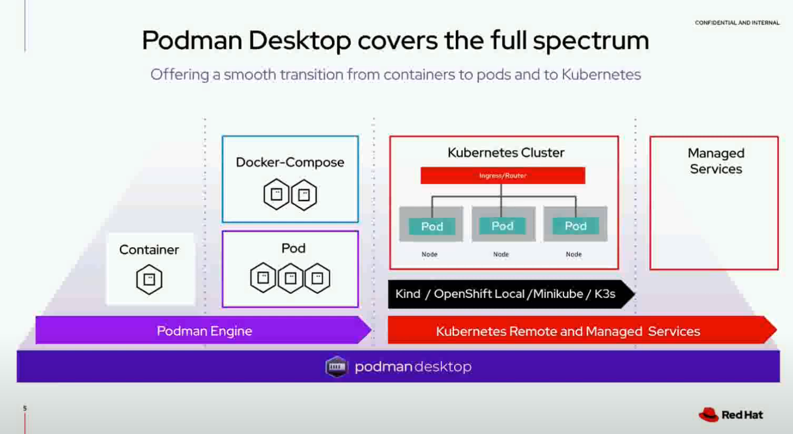

# Docker

# WSL2 (Windows Subsystem for Linux) 

## Installation
[https://learn.microsoft.com/en-us/windows/wsl/install](https://learn.microsoft.com/en-us/windows/wsl/install)

## Install CUDA on Windows11 using WSL2 for ML/DL Using Nvidia Graphics Card
Good tutorial with  detaile screenhsots [https://github.com/FahimFBA/CUDA-WSL2-Ubuntu](https://github.com/FahimFBA/CUDA-WSL2-Ubuntu)

VS MS Tutorial :) : [https://learn.microsoft.com/en-us/windows/wsl/tutorials/gpu-compute](https://learn.microsoft.com/en-us/windows/wsl/tutorials/gpu-compute)

## WSL2 (Windows Subsystem for Linux) vs Linux

"Docker Desktop with WSL2 should not be considered a production-ready environment, especially in an enterprise environment.
WSL2, it is designed primarily for end-users (developer/sysadmin/CLI-user).

Microsoft makes this fairly (but not crystal) clear in the [WSL FAQ](https://learn.microsoft.com/en-us/windows/wsl/faq#can-i-use-wsl-for-production-scenarios--):

Can I use WSL for production scenarios?
WSL has been designed and built to use with inner loop development workflows. There are design features in WSL that make it great for this purpose but may make it challenging for production-related scenarios compared to other products. Our goal is to make clear how WSL differs from a regular VM environment, so you can make the decision on whether it fits your business needs."
source: https://stackoverflow.com/a/76149745

Full list from MS website:
The main differences between WSL and a traditional production environment are:

* WSL has a lightweight utility VM that starts, stops and manages resources automatically.
I*f you have no open file handles to Windows processes, the WSL VM will automatically be shut down. This means if you are using it as a web server, SSH into it to run your server and then exit, the VM could shut down because it is detecting that users are finished using it and will clean up its resources.
* WSL users have full access to their Linux instances. The lifetime of the VM, the registered WSL distributions, etc., are all accessible by the user and can be modified by the user.
* WSL automatically gives file access to Windows files.
* Windows paths are appended to your path by default, which could cause unexpected behavior for certain Linux applications compared to a traditional Linux environment.
* WSL can run Windows executables from Linux, which could also lead to a different environment than a traditional Linux VM.
* The Linux kernel used by WSL is updated automatically.
* GPU access in WSL happens through a /dev/dxg device, which routes GPU calls out to the Windows GPU. This setup is different than a traditional Linux set up.
There are other smaller differences compared to bare metal Linux and more differences are expected to arise in the future as the inner loop development workflow is prioritized.

# Podman

## Podman desctop

https://podman-desktop.io/features
Podman desctop is open source tool located on page[github.com/containers/podman-desktop](https://github.com/containers/podman-desktop)

[Podman desctop blog page](https://podman-desktop.io/blog)

image source: [youtube.com - Podman Desktop-Simplifying the experience working with containers and K8s ](https://www.youtube.com/watch?v=3aPQi7I55rw)

### Code Architecture
Frameworks and tooling
Within Podman Desktop, we use the following frameworks and tools to build the desktop application:

- Electron: In order to deploy cross-platform to multiple operating systems.
- Svelte: The reactive UI/UX framework for building the interface.
- Tailwind CSS: A utility-first CSS framework for the UI/UX framework.
- Vite: Dev tooling for rapid development, debugging and deployment.

**NOTE: We also use TypeScript instead of JavaScript for strongly typed programming language development.**

### Testing
Within Podman Desktop, we use the following for testing:

- Vitest: Unit tests - Written as spec.ts files.
- Testing Library: Component tests - Utilities and best practices for writing component tests.
- Playwright: Integration and E2E tests.

