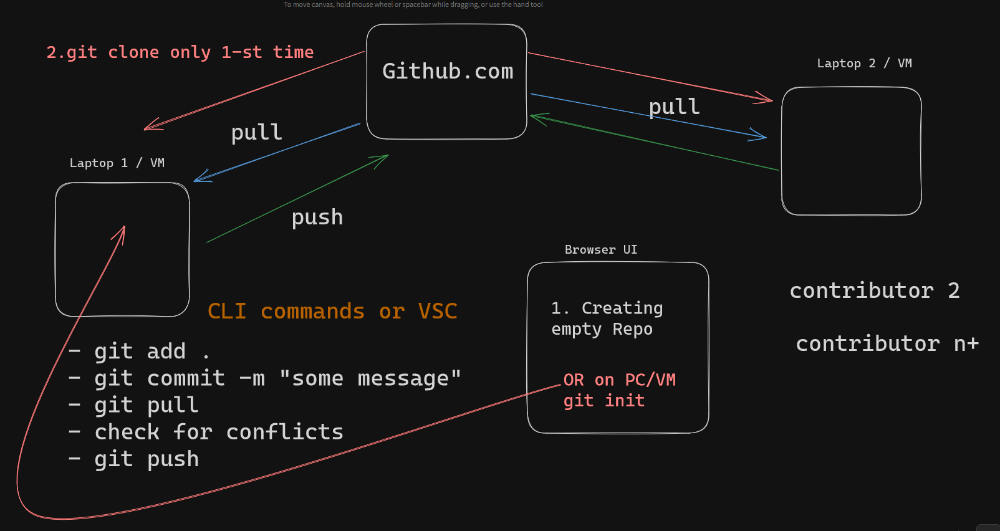

## How to create projects on GitHub.com

[How to create projects on GitHub.com](https://youtu.be/aJ8y_OrQ9q0)


##  How Github works with basic usage and diagram



[ExcaliDraw file](./files/How-Github-works-with-basic-usage-and-diagram.excalidraw)

Dev Sharing video tutorial: [How Github works with basic usage and diagram](https://youtu.be/QEnC9XlwkGE)

```sh
# creating empty repo inside new directory
git init
# or clone existing repo from VSC editor

# add new files and all changes related with them
git add .
# commit message
git commit -m "some message"

# get last file versions from main repo
git pull

# check for conflicts

# uploud all files to repo
git push
```


## How to setup and use GitHub with Visual Studio Code part 1

[How to setup and use GitHub with Visual Studio Code part 1](https://youtu.be/HRazV6pvnn4)

```sh
sudo apt-get install git

git --version
```

## How to setup and use GitHub with Visual Studio Code part 

[How to setup and use GitHub with Visual Studio Code part 2](https://youtu.be/c07OjZSlNHA)

```sh
git config --global user.name "Yor First Name"
git config --global user.email "example@test.com"
```
