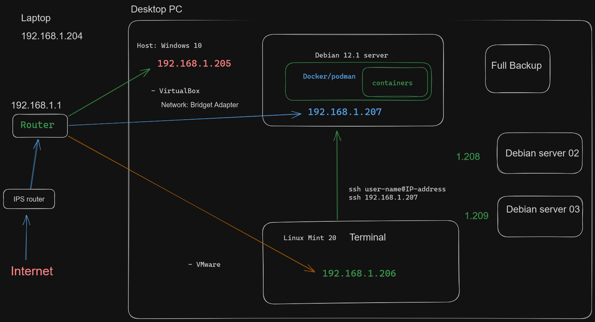
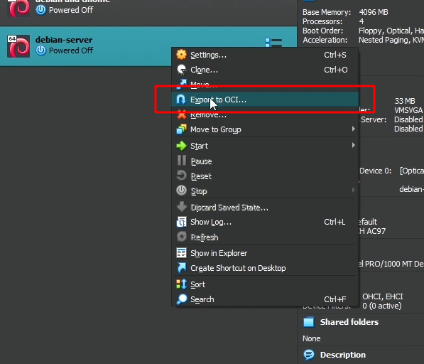
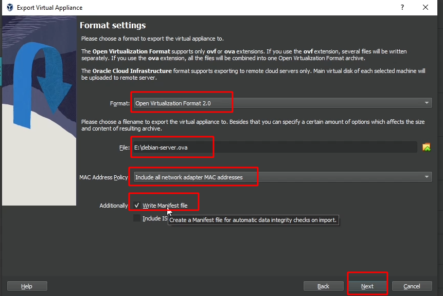

# Ventoy How to make bootable USB with multiple OS

Dev Sharing video tutorial: [Ventoy How to make bootable USB with multiple OS](https://youtu.be/w2eYkqmN3so)

[Ventoy screenshots](https://www.ventoy.net/en/screenshot.html)
[Ventoy download page](https://www.ventoy.net/en/download.html)


# VirtualBox

## How to install Debian 12.1 server on VirtualBox under Windows 10
Dev Sharing video tutorial: [How to install Debian 12 1 server on VirtualBox under Windows 10](https://youtu.be/5SBj0VYWpJE)

Visit Debian download page [www.debian.org/CD/netinst/](https://www.debian.org/CD/netinst/)

## How to install Debian 12.1 server on VirtualBox under Windows 10 part 2

Dev Sharing video tutorial: [How to install Debian 12.1 server on VirtualBox under Windows 10 part 2](https://youtu.be/GIux_IcUESc)

```sh
# chake current IP LAN address
ip a

# ssh login example
ssh developer@192.168.1.207

```

## How to install Debian 12.1 server on VirtualBox under Windows 10 part 3

Dev Sharing video tutorial: [How to install Debian 12.1 server on VirtualBox under Windows 10 part 3](https://youtu.be/qVbwLyB0sJc)



[ExcaliDraw file with diagram ](./files/VirtuaBox-network-bridged-adapter-001.excalidraw)

## Debian server how to resize VM terminal login like a root and power-off machine

Dev Sharing video tutorial:: [Debian server how to resize VM terminal login like a root and power-off machine](https://youtu.be/XmesFfqdGzA)

```sh
# login like a root user
debian login: root
# fill your passoerd
Password:

# show how match RAM use the virtual machine
# h - option is for human readable format like: kilobites(Ki/)Mi/Gi
free -hm

systemctl poweroff
```

## Debian server how to update packages install sudo command and add current user to sudo group
Dev Sharing video tutorial variant: [Debian server how to update packages install sudo command and add current user to sudo group](https://youtu.be/t45FkdFFfus)

### First commands after installing Debian server

Sudo (sometimes considered as short for Super-user do) is a program designed to let system administrators allow some users to execute some commands as root (or another user). The basic philosophy is to give as few privileges as possible but still allow people to get their work done. Sudo is also an effective way to log who ran which command and when.

Why sudo?
Using sudo could be more familiar to newer users, and it could be better (safer) than allowing a normal user to open a session as root. Some reasons:

* Nobody needs to know the root password (sudo prompts for the current user's password). Extra privileges can be granted to individual users temporarily, and then taken away without the need for a password change.

* It's easy to run only the commands that require special privileges via sudo; the rest of the time, you work as an unprivileged user, which reduces the damage that mistakes can cause.

* Auditing/logging: when a sudo command is executed, the original username and the command are logged.

source : [wiki.debian.org/sudo](https://wiki.debian.org/sudo)

```sh
# log in with user root and  password of the root user that you specified during your Debian installation, and press Enter)
su

# show disk usage
df -h
# show used and free RAM
free -mh

# Update the packages index on Debian Linux
apt update

# if no errors from prev. command 
apt upgrade

# install needed packages
apt install sudo curl

# add new(still not created user) user and setup password during this process
adduser  developer

# add user to group of super user, sol we can use sudo command like in Ubuntu server
sudo usermod -aG sudo developer

# To see a list of accounts that belong to the sudoers group
sudo getent group sudo

# exit  root user
exit

# log like new created user
developer

# now test to run some command like sudo user, if this not work then please do a full logout and login again.
sudo apt update
```

## Debian server how to assign static IP address
Dev Sharing video tutorial variant:[Debian server how to assign static IP address](https://youtu.be/ILOtQwcl1zo)

### Setup LAN IP address for Debian 12 server

```sh
# Linux version information
uname -a

# show LAN IP
hostname -I
# OR
ip addr
```

Open and edit file 
```sh
sudo nano /etc/network/interfaces
```
you want to set up, netmask, gateway, dns-nameservers.
Append to the end of file this lines:
```
auto enp0s3
iface enp0s3 inet static
address 192.168.1.207
netmask 255.255.255.0
gateway 192.168.1.1
dns-nameservers 8.8.4.4 8.8.8.8
```
To save the changes you have made in the network interface configuration file, 
press “CTRL+X”

```sh
sudo service NetworkManager restart
sudo service NetworkManager status
# OR
sudo systemctl restart NetworkManager
# If  you get some errors just restart VM with 
sudo sudo systemctl poweroff
```
test for Internet connection
```sh
ping google.com
```


## Export Virtual Machine to .OVA File in Oracle VM VirtualBox

Dev Sharing video tutorial variant: [https://youtu.be/EYlVYd7xgiE](https://youtu.be/EYlVYd7xgiE)

Open VirtualBox , select wnated virtual machine and pres right mouse click


Example export settings


Format:
- [x] Open Virtualization Format 2.0

MAC Address Policy: 
- [x] Include all network adapter MAC addresses – keep all MAC addresses assigned on network cards on the virtual machine
Additionally:
- [x] Write Manifest File – this file will automatically check the data integrity and prevent the deployment of damaged appliance.


# Ansible

see DevSharing developer-roadmap ...

source: /mnt/hgfs/D/1-tutorials/Udemy - Mastering ansible in an hour and the half

To use Ansible you need to have on your machine Python 3 or via package, 
for remote machines you need to have python3 too ,but without to install nothing.
Ansible just use integrated modules in Python3 to interact with remote machine


## Install on linux

Use pip in your selected Python environment to install the full Ansible package for the current user:
```
python3 -m pip install --user ansible
```


## Inventory
Inventory is list of Hosts located in /etc/ansible/hosts
Gorups with hosts

```yml
[db]
database.host[1:2]

[webserver]
apache.host1
nginx.host2
```

Flag "-i" is used


## Modules
Modules are tools for particular task
```yml
- name: install Apache
  yam:
    name: httpd-2.2.2-2.2.amzn1
    state: present
```

## Variables
Variables are how we deal with differences betwean systems

## Facts
facts provide information about target host
facts gathering may be disabled

## Playbooks
Playbooks are Ansible's configurations, deployment and orchestration language
Playbooks are expressed in YAML format
The goal of a play is to map a group of some well defined roles

## Configuration Files
ansible.cfg in current directory

# Ad-hock

Ad-hoc is just single module run
check logs
check for packages
gather system information

```
ansible -i inventory 127.0.0.1 - setup
```

Common modules
ping - validate server i up
setup - gather facts
apt - apt package manager
yum - Yum package manager 
service - control system users: start stop and restart services
copy - copy files
file - work with files

Other usage: restart server, add or remove user and users groups, copying files to or from servers, cron jobs,

